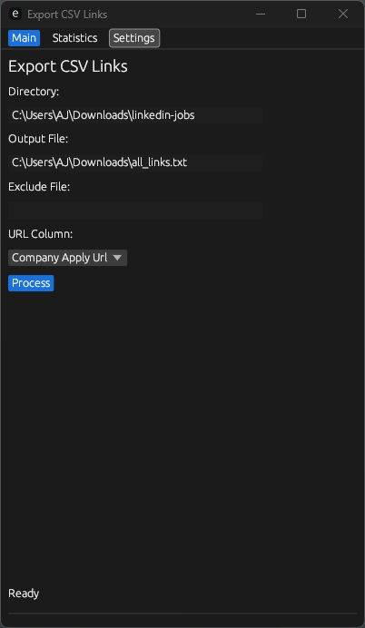

# CSV Link Extractor

A GUI application for extracting URLs from CSV files with master list management, deduplication, and configurable settings.

## Features

- Process multiple CSV files concurrently
- Extract URLs from specified column
- Maintain a master list of previously processed URLs
- Exclude URLs using an exclude list file
- Auto-deduplicate URLs against master list and current batch
- Dark mode interface with three main sections:
  - Main: Primary processing controls
  - Statistics: Processing metrics and master list cleaning
  - Settings: Application configuration

## Settings

- Timestamp Output Files: Automatically add timestamps to output filenames (e.g., output_20240216_235959.txt)
- Workers: Configure number of concurrent processing threads (1-16)
- Skip Header: Skip first data row in CSV files
- Continue on Error: Keep processing if individual files fail
- Timeout: Set HTTP request timeout (1-300 seconds)
- Master List: Configure path to master list file for URL tracking
- Sample CSV: Set a sample CSV to automatically detect URL column headers

## Statistics

- Track total files processed
- Count total, unique, excluded and duplicate URLs
- Display processing time and last run timestamp
- Reset statistics as needed
- Clean master list to remove any duplicates

## Screenshots

### Main Interface (2024-02-08)
[Main Interface]



*Dark theme interface with URL processing controls*

### Statistics Dashboard (2024-02-08)
[Statistics Dashboard]


*Real-time processing statistics and history*

## Usage

1. Set your processing options in Settings
2. Select input directory containing CSV files
3. Choose output file location
4. Select URL column from detected headers
5. Optional: Configure exclude file path
6. Click Process to begin extraction

All settings are automatically saved between sessions.

## Building

```bash
cargo build --release
```

The compiled application will be available in `target/release/export_csv_links.exe`

## Requirements

- Windows operating system
- CSV files with consistent column headers
- URLs must be in standard HTTP/HTTPS format
